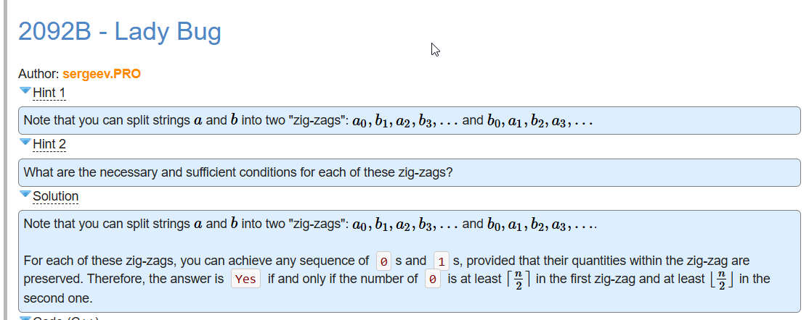

- [Problem - B - Codeforces](https://codeforces.com/contest/2092/problem/B)
- [2090B_Lady_Bug.cpp](../assets/2090B_Lady_Bug_1744741493573_0.cpp)
- Tag
  collapsed:: true
	- [[brute force]]
	- [[constructive algorithms]]
	- [[implementation]]
	- [[math]]
	- [[1000]]
- Solutions and Hints
  collapsed:: true
	- 
	- [[C++]] Code
	  ```
	  #include <iostream>
	   
	  using namespace std;
	   
	  void solve() {
	      int n; cin >> n;
	      string a, b; cin >> a >> b;
	      int cnt1 = 0, cnt2 = 0;
	      for (int i = 0; i < n; ++i) {
	          if (i & 1) {
	              cnt2 += a[i] == '0';
	              cnt1 += b[i] == '0';
	          } else {
	              cnt1 += a[i] == '0';
	              cnt2 += b[i] == '0';
	          }
	      }
	      cout << (cnt1 >= (n + 1) / 2 && cnt2 >= n / 2 ? "Yes" : "No") << '\n';
	  }
	   
	  signed main() {
	      ios_base::sync_with_stdio(false);
	      cin.tie(nullptr);
	      cout.tie(nullptr);
	      int t; cin >> t;
	      while (t--) solve();
	  }
	  ```