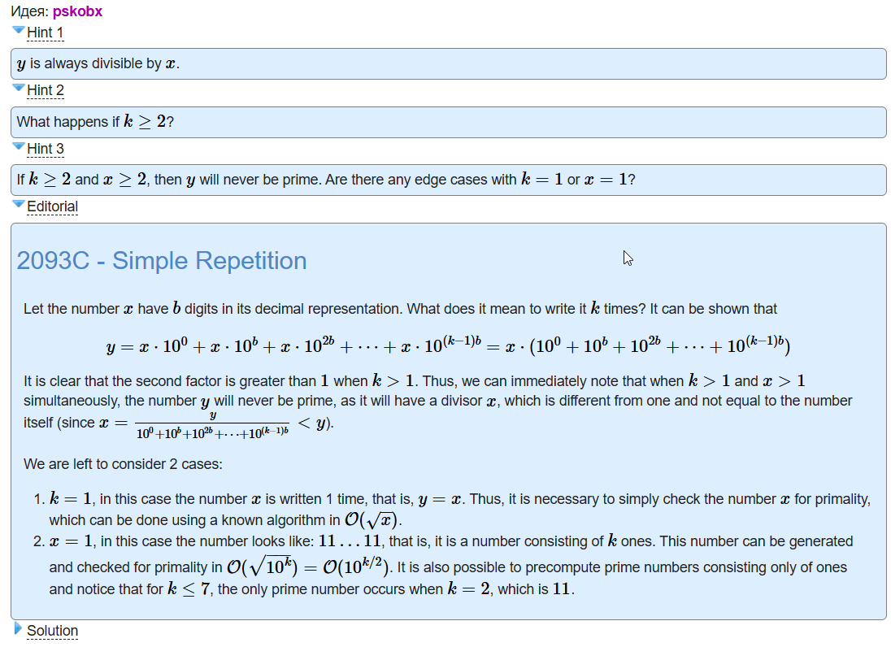

- [2093C - Simple Repetition](https://codeforces.com/contest/2093/problem/C)
- [[math]]
- [[number theory]]
- [[1000]]
- 
- [C_Simple_Repetition.cpp](../assets/C_Simple_Repetition_1744987163209_0.cpp)
- ```c++
  #include <bits/stdc++.h>
   
  using namespace std;
   
  bool is_prime(int x) {
      if (x <= 1) {
          return false;
      }
      for (int i = 2; i * i <= x; i++) {
          if (x % i == 0) {
              return false;
          }
      }
      return true;
  }
   
  void solve() {
      int x, k;
      cin >> x >> k;
      if (k > 1 && x > 1) {
          cout << "NO";
      } else if (k == 1) {
          cout << (is_prime(x) ? "YES" : "NO");
      } else {
          cout << ((k == 2) ? "YES" : "NO");
      }
  }
   
  int main() {
      int tests;
      cin >> tests;
      while (tests--) {
          solve();
          cout << '\n';
      }
  }
  ```